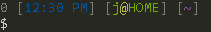

# dotfiles

[](https://travis-ci.org/j-/dotfiles)

## Installation

```sh
git clone --depth 1 https://github.com/j-/dotfiles
. dotfiles/init.sh
```

# Prompt



Features:
* Previous command exit status
* Current time
* User name
* Host name
* Current directory
* Git/Mercurial branch

## PATH

The `~/.path` directory is used as an easy way to define paths. Any directory
(or symbolic link to a directory) inside will be added to `$PATH`.

For example, to add `~/bin` to `$PATH`:

    $ ln -s ~/bin ~/.path/bin

`$PATH` will be updated next time `.bash_profile` is sourced.

## Sublime Text on Windows

Make a directory link in `cmd`:

    > mklink /D "%USERPROFILE%\.path\Sublime Text 2" "%ProgramFiles%\Sublime Text 2"
